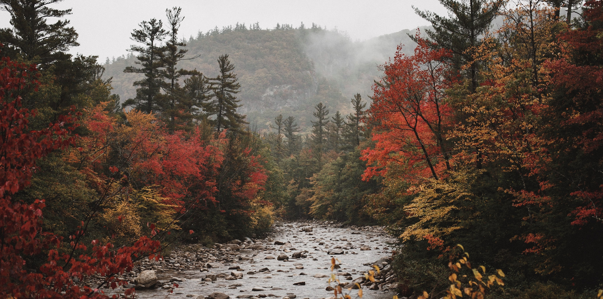

<h1 align="center"> Steve Simkins </h1>



```javascript
import React from 'react'; 

const Bio = () => {
	return (
	    <div class="biolist">
	      <ul>
		<li>⚡️ Quick bio: Photographer turned front-end web developer, coffee addict, 
		       keyboard lover, husband and father, 4 cats</li>
		<li>🔭 I’m currently working on: DevTimer, a film photography web app using React</li>
		<li>📫 How to reach me: <a href="https://stevedsimkins.dev">My Website!</a></li>
	      </ul>
	    </div>
	)
};

export default Bio;
```
----

<h4>Favorite Tools</h4>

       

<h4>Connect With Me!</h4>  

<a href="https://stevedsimkins.dev" target="_blank"></a>
<a href="https://hashnode.com/@stevedsimkins" target="_blank"></a>
<a href="https://www.twitter.com/stevedsimkins" target="_blank"></a>
<a href="https://instagram.com/stevedsimkins.dev" target="_blank"></a>
<a href="https://facebook.com/sdsimkins" target="_blank"></a>
